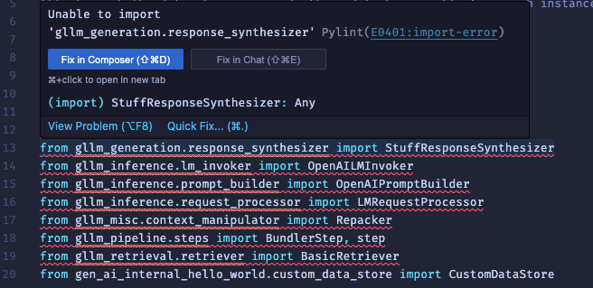
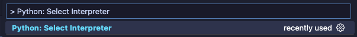
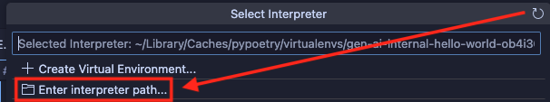
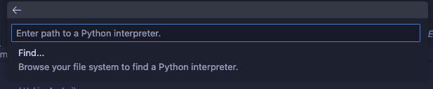
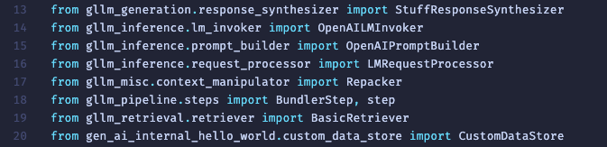

# GenAI RAGO Example Using Source Code Version of SDK

This is an example of how to use the gllm-pipeline library to build a simple RAG pipeline using source code version of SDK.

See other examples in [gen-ai-examples](https://github.com/GDP-ADMIN/gen-ai-examples).

## Prerequisites

> [!NOTE]
> You need to fulfill the prerequisites to run the script.

1. **Python v3.12** (to run `python`)

   - Using Conda (recommended):

     You can use [Miniconda](https://docs.anaconda.com/miniconda/install) to install and manage Python versions.

   - <details>
     <summary>Using Python installer (alternative)</summary>
     
     You can download the Python installer from the link [Python 3.12.8](https://www.python.org/downloads/release/python-3128/), select the version appropriate for your operating system, and run the installer.

     > [!NOTE]
     > For Windows, please make sure to check the `Add python.exe to PATH` option during the installation process.
   </details>

2. **Access to GDP-ADMIN/gen-ai-internal repository**

   You can try to access the [GDP-ADMIN/gen-ai-internal](https://github.com/GDP-ADMIN/gen-ai-internal) repository in your browser. If you don’t have access, please make a request to ticket(at)gdplabs.id.

3. **SSH Key in your GitHub Account**

   You must add your SSH key to your GitHub account. Please follow this instruction by GitHub: [Adding a new SSH key to your GitHub account](https://docs.github.com/en/authentication/connecting-to-github-with-ssh/adding-a-new-ssh-key-to-your-github-account). This is required as this sample has dependency to a private GitHub repository.

4. **VSCode IDE**

   - Go to [VSCode](https://code.visualstudio.com/download) to download VSCode IDE.

## Running the Code

1. Configure environment variables: copy `.env.example` to `.env` and set up your `OPENAI_API_KEY` and `LANGUAGE_MODEL`.

   - For Linux, macOS, or Windows WSL:

     ```bash
     cp .env.example .env
     ```

   - For Windows Powershell or Command Prompt:

     ```powershell
     copy .env.example .env
     ```

2. Execute the script:

   - For Linux, macOS, or Windows WSL:

     ```bash
     ./local-start.sh
     ```

     > [!NOTE]
     > On Windows, you can either install [WSL (Windows Subsystem for Linux)](https://learn.microsoft.com/en-us/windows/wsl/install) or execute the batch file in Windows Powershell or Command Prompt as described in the next section.

   - For Windows Powershell:

     ```powershell
     .\local-start.bat
     ```

   - For Windows Command Prompt:

     ```cmd
     local-start.bat
     ```

   The program will then wait for your question:

   > Question:

   Type your question and press enter. For example, you can try asking:

   ```
   What are the documents?
   ```

   The RAG pipeline will return the following response (more or less):

   > _The documents mentioned are referred to as Mock document 1, Mock document 2, and Mock document 3. However, without additional context or content from these documents, I cannot provide specific details about their contents or purposes._

## Setting Python Interpreter Path in VSCode IDE

Set up the Python interpreter path in your IDE by following these instructions:

> [!WARNING]
> You must complete the steps in [Running the Code](#running-the-code) until you see the `gen-ai-internal-hello-world example finished running.` on the console before continuing with the steps below on this section.

1. Open the code sample in VSCode and open [main.py](/examples/gen-ai-internal-hello-world/gen_ai_internal_hello_world/main.py) file.

   You might encounter import error like the screenshot below.

   

2.  After you run `./local-start.sh` using steps in [Running the Code](#running-the-code), you will see the log `Getting python interpreter path for use in IDE...`. Copy the path in the next line, which usually looks something like:

    ```
    /home/<username>/.cache/pypoetry/virtualenvs/gen-ai-internal-hello-world-ob4i36ef-py3.12/bin/python
    ```

3.  Open command palette (`⌘+Shift+P` for Mac or `Ctrl+Shift+P` for Linux/Windows) and type `> Python: Select Interpreter` and press enter.

    

4.  Select `Enter interpreter path...`

    

5.  Paste the previously copied path from the console and press enter.

    

Your IDE will then recognize the path and will no longer show red squiggly lines under the import statements. You can try hovering over them to see the details of the library.



## FAQs

### 1. I got error `Unable to access repository GDP-ADMIN/gen-ai-internal. Please check your GitHub credentials and repository permissions.`. How do I fix it?

You need to have access to the repository. If you don’t have access, please make a request to ticket(at)gdplabs.id.

If you haven't setup your SSH key, you might get error `HangupException. The remote server unexpectedly closed the connection.` or `Permission denied (publickey)` or `Cannot install gllm-core`. To fix this, you need to add your SSH key to the GitHub account. Please follow this instruction by GitHub: [Adding a new SSH key to your GitHub account](https://docs.github.com/en/authentication/connecting-to-github-with-ssh/adding-a-new-ssh-key-to-your-github-account).

### 2. I got error `Error executing component StuffResponseSynthesizer__user_query_response_synthesis_bundle`. How do I fix it?

Check `.env` file (if you already run `local-start.sh`, it is auto generated). You might have provided invalid `OPENAI_API_KEY` and/or `LANGUAGE_MODEL`.

```txt
# GDP Labs Gen AI Hello World Example
# Please edit the following variables with your own values.

OPENAI_API_KEY =<YOUR_OPENAI_API_KEY> # Get your OpenAI API key from https://platform.openai.com/api-keys
LANGUAGE_MODEL =<VALID_OPENAI_LANGUAGE_MODEL_NAME> # e.g. "gpt-3.5-turbo", "gpt-4o-mini", "gpt-4o"
```

### 3. I got error `ImportError: failed to find libmagic`. How do I fix it?

This typically happens if you use macOS or Windows.

#### Install `libmagic` in macOS

For macOS, there two alternatives:

1. If you have [conda](https://docs.anaconda.com/miniconda/install/) installed:

```
conda install libmagic
cd /usr/local/lib
sudo ln -s /opt/miniconda3/pkgs/libmagic-5.39-h6ba3021_1/lib/libmagic.dylib libmagic.dylib
```

> [!WARNING]
> Please adjust the path of your Conda installation if it differs. In the example above, the path is `/opt/miniconda3/`.

2. If you have [brew](https://brew.sh/) installed:

```
brew install libmagic
```

### 4. I got `Unable to import 'gllm_generation.response_synthesizer'` error in VSCode IDE. How do I fix it?

You need to change the Python interpreter path in your IDE. The step-by-step detail to do this is available in the [Setting Python Interpreter Path in VSCode IDE](#setting-python-interpreter-path-in-vscode-ide) section above.
